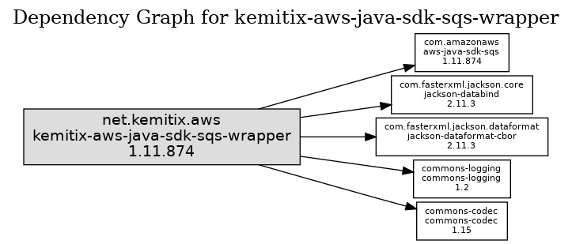

# kemitix-aws-java-sdk-sqs-wrapper
Wrapper for the AWS Java SDK for SQS - only releases when there is a change that effects the SQS portion of the AWS Java SDK


[](
https://oss.sonatype.org/content/repositories/releases/net/kemitix/aws/kemitix-aws-java-sdk-sqs-wrapper/)
[](
https://search.maven.org/search?q=g:net.kemitix.aws%20a:kemitix-aws-java-sdk-sqs-wrapper)

## Objectives

* avoid upgrade noise from automatic upgrades when SQS portion of SDK doesn't change
* upgrade transitive dependencies to remove security alerts

## Rationale

The Official AWS Java SDK releases new versions almost daily. These changes 
seldom relate to the SQS portion of the SDK. If you are using a system like
GitHub's Dependabot to automatically upgrade your dependencies, then this
can generate a lot of noise on a project that might otherwise not need
updated. Additionally, the AWS Java SDK maintains compatibility with old
unsupported versions of Java. This imposes a dependency on old versions of
libraries such as Jackson that no longer support those Java versions. This 
wrapper is not attempting provide that same support, allowing those old 
versions, which have security issues unrelated to their use in the AWS Java SDK,
to be upgraded.

Ref: 
[AWS Java SDK Readme](
https://github.com/aws/aws-sdk-java/blob/master/README.md#security) and 
[The AWS SDK for Java will no longer support Java 6](
https://aws.amazon.com/blogs/developer/the-aws-sdk-for-java-will-no-longer-support-java-6/).

## Usage

```xml
<dependency>
  <groupId>net.kemitix.aws</groupId>
  <artifactId>kemitix-aws-java-sdk-sqs-wrapper</artifactId>
  <version>${aws-java-sdk-version}</version>
</dependency>
```

## Features

Includes a dependency upon `aws-java-sdk-sqs`, with updated security 
dependencies.


## Release Cadence

New versions will have the same version as the AWS Java SDK that they
are aligned with. New versions will only be released when the AWS Java SDK 
makes a change that effects the SQS portion of the SDK, or when an overridden
transient dependency is release, e.g. Jackson. When a transient dependency 
release is incorporated, the AWS Java SDK version will also be updated, even 
if there is no changes to the SQS component.

## Dependencies


